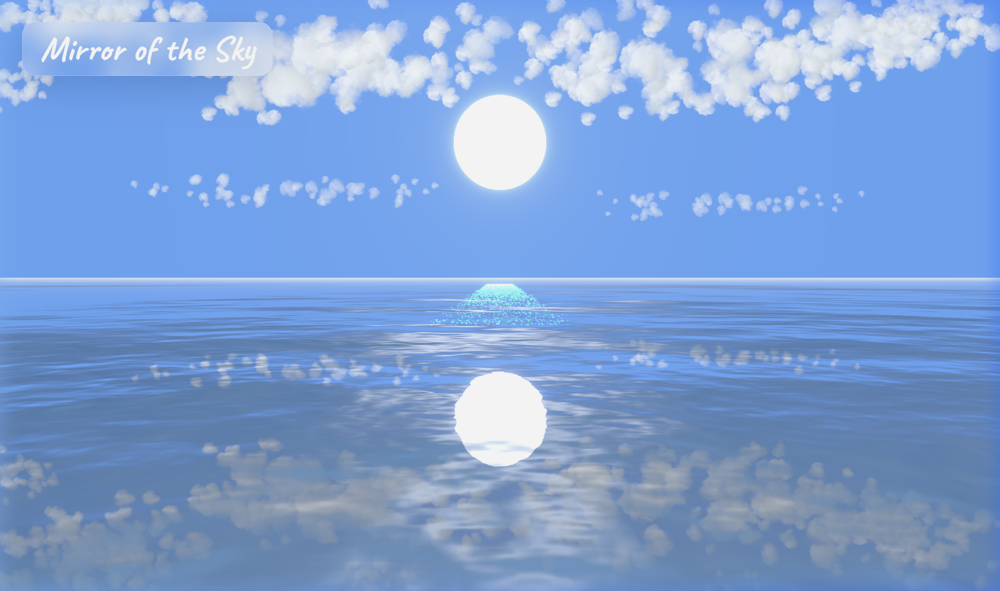

# 🪞 Mirror of the Sky — 天空之镜

> 一个使用 React Three Fiber 构建的沉浸式 3D 海天一线场景。



---

## ✨ 项目亮点

| 特性 | 描述 |
|------|------|
| 🌊 **镜面水体** | 基于 Three.js Water 组件，结合法线贴图与精调参数，呈现极致平滑的镜面反射效果 |
| ☀️ **风格化太阳** | 放弃物理天空渲染，使用发光球体 + Bloom 后处理，打造梦幻柔和的太阳光晕 |
| ☁️ **体积云层** | 采用 `@react-three/drei` 的 Cloud 组件，MeshBasicMaterial 渲染出手绘般纯白通透的云朵 |
| ✨ **氛围粒子** | 3000 颗 Additive Blending 发光粒子沿水面飘移，营造星尘光流的空灵感 |
| 🎥 **呼吸镜头** | CameraRig 跟随鼠标 lerp 平滑漫游，叠加微幅正弦呼吸动画，让画面始终"活着" |
| 🧊 **玻璃态 UI** | Glassmorphism 风格的 HUD 信息卡片，`backdrop-filter: blur` + 半透明渐变，现代而优雅 |

---

## 🛠️ 技术栈

```
React 19          — UI 框架
Vite 7            — 构建工具，极速 HMR 开发体验
Three.js r183     — 3D 渲染引擎
R3F (Fiber)       — Three.js 的 React 声明式封装
@react-three/drei — 常用 3D 组件库（Cloud, Environment, Loader 等）
@react-three/postprocessing — 后处理效果（Bloom）
```

---

## 📁 项目结构

```
Mirror of the Sky/
├── public/
│   ├── hdr/                    # HDR 环境贴图（供水面反射采样）
│   ├── textures/               # 水面法线贴图 waternormals.jpeg
│   └── vite.svg
├── src/
│   ├── main.jsx                # React 根挂载入口
│   ├── index.css               # 全局样式 & 字体引入（Outfit + Caveat）
│   ├── App.jsx                 # 应用主组件：Canvas 画布 + HUD 叠加层
│   ├── App.css                 # HUD 玻璃态卡片样式
│   ├── assets/                 # 静态资源
│   └── scene/                  # 🎬 3D 场景组件目录
│       ├── SeaSkyScene.jsx     # 场景总装配：灯光系统 + 子组件编排
│       ├── SkyEnvironment.jsx  # 天空：背景色 + 发光太阳 + 体积云 + 环境贴图
│       ├── WaterSurface.jsx    # 水面：Water 组件 + 法线贴图 + 动画循环
│       ├── CameraRig.jsx       # 镜头控制：鼠标跟随 + 呼吸漫游
│       ├── AtmosphereParticles.jsx  # 粒子系统：星尘光流动画
│       └── FloatingAnchors.jsx # 占位锚点：Boat / Sign 模型预留槽位
├── index.html
├── package.json
├── vite.config.js
└── eslint.config.js
```

---

## 🎨 设计思路

### 为什么不用物理天空？

Three.js 内置的 `Sky` 着色器虽然真实，但在低角度场景中容易显得灰暗、过曝且难以控制色调。本项目选择了**全风格化路线**：

1. **纯色宝石蓝背景** (`#64aaff`) 作为天空底色，确保全时段都呈现清澈的蓝。
2. **发光球取代物理 Sun**，配合 `@react-three/postprocessing` 的 Bloom 效果，让太阳边缘泛化成柔和的光晕。
3. **MeshBasicMaterial 云朵** 代替 StandardMaterial，保证云团始终呈现手绘般的纯净白色，不受复杂光照影响。

### 水面参数调优

Water 组件的默认参数偏向波涛汹涌的海洋效果。为实现"天空之镜"的宁静感，进行了如下调整：

| 参数 | 默认值 | 调优值 | 目的 |
|------|--------|--------|------|
| `distortionScale` | 3.7 | **0.25** | 大幅降低波浪扭曲，趋近镜面 |
| `size` | 1.0 | **1.6** | 拉大波纹纹路，显得更广阔平缓 |
| `waterColor` | `#001e0f` | **`#78bfff`** | 清淡透亮蓝色，主要靠天空倒影决定色调 |
| `sunDirection` | — | `(0, 0.4, -1)` | 太阳光正对镜头打下，形成强烈的水面高光带 |
| `opacity` | 1.0 | **0.98** | 微透，配合 `FogExp2` 实现远端天水交融 |

---

## 🚀 快速启动

```bash
# 1. 克隆或进入项目目录
cd "Mirror of the Sky"

# 2. 安装依赖
npm install

# 3. 启动开发服务器
npm run dev
```

浏览器打开 `http://localhost:5173/`，轻轻移动鼠标即可体验天空之镜的浮游感。

---

## 🔧 可用命令

| 命令 | 描述 |
|------|------|
| `npm run dev` | 启动 Vite 开发服务器（HMR 热更新） |
| `npm run build` | 构建生产环境产物到 `dist/` 目录 |
| `npm run preview` | 本地预览构建产物 |
| `npm run lint` | ESLint 代码检查 |

---

## 🧩 扩展计划

项目中已预留了两个模型占位槽（`FloatingAnchors.jsx`），可通过 `debug={true}` 参数查看线框调试锚点：

- **🚢 Boat Slot** — 位置 `(0, 0.15, -18)`：计划放置一艘漂浮在水面上的小船模型
- **🪧 Sign Slot** — 位置 `(7.5, 0.85, -15)`：计划放置一个立在水中的文字标识牌

---

## 📄 License

MIT © 2026
